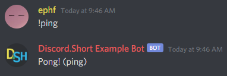

# Discord.Short  (Discord.js Addon)

Discord.Short is a Discord.js addon so that you can make discord bots faster.
You can use the command line for some commands, and you create bots in javascript files.
Discord.Short offers support for 2 free programs, MongoDB (JavaScript Database), and Heroku (Node.js JavaScript Hosting)
To start, lets download Discord.Short, you will need to download it globally so that the commands work!

```console
$ npm install discord.short -g
```

# Terminal Commands / Creating a bot

to get started, lets type in the discord.short command:

```console
$ ds
```

You should get an error like this:


If you didn't get this, you might want to check if you downloaded Discord.Short globally 
*make sure you add `-g`*

now we want to make a bot, you can do this by typing in the command (`$ ds createbot`) with the last argument being the name of the bot file.
so running the command:

```console
$ ds createbot example
```

which will create an `example.js` file, and will have the contents:

```js
// create a client
const Discord = require('discord.short');
const ds = new Discord.Client('example');

// login
ds.login({
  "botToken": "...",
  "mongo": {
    "username": "...",
    "password": "...",
    "database": "discordshort"
  },
  "heroku": {
    "name": "..."
  }
});
```

using the premade script, you can enter your data, and you can change the `mongo.database` to anything you would like.

# Creating Bot Commands

after the premade script, you can start to build commands for your bot.
but first, you want to make a prefix for your bot:

```js
ds.setPrefix('!'); // our example prefix is "!"
```

then we can make a new command:

```js
new ds.Command({
    name: 'ping', // name of command
    aliases: ['p'], // other names that can be used
    async execute({arguments}) { // function that runs when the command is used *MUST BE ASYNC*
        // args
    }
});
```

where you saw the arguments, you can add any of the following:

* "message" - the message sent
* "author" (message.author) - the user who sent the message
* "channel" (message.channel) - the channel the message was sent in
* "guild" (message.guild) - the server the message was sent in
* send() (message.channel.send) - a function to send a message in the channel that the message was in
* "args[]" - the arguments (split by a space) after the command
* label - the command they used (shows which alias / name they used)

so lets finish the ping command, and add which alias they used:

```js
new ds.Command({
    name: 'ping',
    aliases: ['p'],
    async execute({send, label}) { // getting "send" and "label"
        send(`Pong! (${label})`);
    }
});
```

overall the file should look like this:

```js
const Discord = require('discord.short');
const ds = new Discord.Client('example');

ds.login({
  "botToken": "token",
  "mongo": {
    "username": "ephf",
    "password": "password",
    "database": "example"
  },
  "heroku": {
    "name": "example"
  }
});

ds.setPrefix('!');

new ds.Command({
  name: 'ping',
  aliases: ['p'],
  async execute({send, label}) {
    send(`Pong! (${label})`);
  }
});
```

we can then run the bot using `node`

```console
$ node example.js
```

and now if you go to your discord server, and type `!ping` you will get this:



then if you type `!p` you will get this:


# Heroku Anti-Idle

Heroku anti-idle will be automatically enabled if you have the `"heroku"` section in your login.
you can disable it using the `dsb` terminal command:

```console
dsb example anti-idle false
```

or in the JavaScipt file:

```js
const Discord = require('discord.short');
const ds = new Discord.Client('example', {
  "heroku": {
    "antiIdle": false // here 
  }
});
```

# MongoDB

You can turn off MongoDB the same way you turn heroku off,

```
dsb example mongo-connect false
```

and

```js
const Discord = require('discord.short');
const ds = new Discord.Client('example', {
  "mongo": {
    "connect": false // here 
  }
});
```

**Connecting**
when you start up your bot, MongoDB will automatically connect. If and error doesn't show up, you can continue.
When writing a command, you can get the data of the person who sent the command by adding `ds.getUserData();`
It will look like this:

```js
new ds.Command({
  name: 'ping',
  aliases: ['p'],
  async execute({send, label}) {

    const myData = await ds.getUserData();
    console.log(myData);

    //send(`Pong! (${label})`);
  }
});
```

when we run this command, you should get an empty object (`{}`)
this is because we haven't set a default data, you can do this by adding (before the command) `ds.defaultUserData();`
Like this:

```js
ds.defaultUserData({
  money: 0,
  name: 'unkown'
});
```

anything that you put in the `defultUserData` will be set whenever a new user is saved to the database.

you can set user data by running `ds.setUserData();`

```js
ds.setUserData({
  money: 3,
  name: 'example-person'
});
```

if you don't add one of the parts, it will still be there in the database!
adding more after setting the money to 3 will do this:

```js
ds.setUserData({
  money: 3,
  name: 'example-person'
});

// after
ds.setUserData({
  money: 12
});

// logging data
console.log(await ds.getUserData());
```

you will get this output:

```js
{
  money: 3,
  name: 'example-person'
}
```

both `ds.getUserData();` and `ds.setUserData();` are promises, so you might want to add `await` before them.

You can also add another argument for the user's id. this will be at the end, like this:

```js
await ds.setUserData({
  money: 153,
  name: 'amazing-example'
}, 'USER-ID');

// and
const data = await ds.getUserData('USER-ID');
```

You can also get all user data by running `ds.getAllUserData();` (also a promise)
it will come in a form like this:

```js
[
  {
    _id: 'USER-ID', // the user's id
    data: { // the data that you game them
      money: 153,
      name: 'amazing-example'
    },
    __v: 0 // useless data
  },
  {
    _id: 'USER-ID',
    data: {
      money: 3,
      name: 'example-person'
    },
    __v: 0
  }
]
```

You can also get / set guild (server) data using the same methods:

```js
ds.defaultGuildData({
  totalMoney: 0,
  users: []
});

const data = await ds.getGuildData('OPTIONAL-GUILD-ID');

const allData = await ds.getAllGuildData();

await ds.setGuildData({
  totalMoney: 156,
  users: [
    'example-person',
    'amazing-example'
  ]
}, 'OPTIONAL-GUILD-ID');
```

# Running Multiple Bots

The reason why this feature is in Discord.Short is because of the limits of heroku apps.
this package was designed to get the most out of a completely free discord bot!

Whenever you create a discord bot, it is added to a file inside the node_modules folder.
when you run the command `dsr` it will run all of the discord bots in that file.

So, whenver you want to run multiple discord bots, make sure to run

```console
$ ds createbot name
```

then when you want to run all of your bots, run

```console
$ dsr
```

# More

Want to join our discord? It's very new, but you can suggest new things you would like to see and ask me (the developer) questions about how this package works!
[[Discord Link]](https://discord.gg/djpgvqypuN)

**Version in Beta / Not Finished**