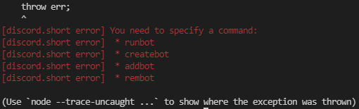

# Discord.Short  (Discord.js Addon)

Discord.Short is a Discord.js addon so that you can make discord bots faster.

You can use teh command line for some commands, and you create bots in javascript files.

Discord.Short offers support for 2 free programs, MongoDB (JavaScript Database), and Heroku (Node.js JavaScript Hosting)

To start, lets download Discord.Short, you will need to download it globally so that the commands work!

```console
$ npm install discord.short -g
```

# Terminal Commands

to get started, lets type in the discord.short command:

```console
$ ds
```

You should get an error like this:

